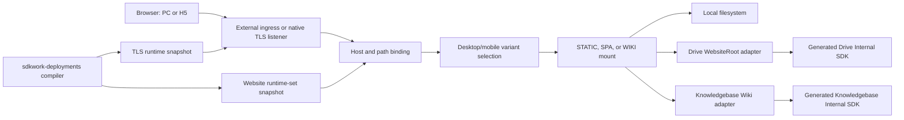

# SDKWork Web Server Production Readiness Review

Status: changes-requested
Owner: SDKWork Web Platform
Reviewed: 2026-07-23
Last updated: 2026-07-29
Application: `sdkwork-web`
Risk: critical
Specs: [CODE_REVIEW_SPEC.md](../../../../sdkwork-specs/CODE_REVIEW_SPEC.md),
[QUALITY_GATE_SPEC.md](../../../../sdkwork-specs/QUALITY_GATE_SPEC.md),
[SECURITY_SPEC.md](../../../../sdkwork-specs/SECURITY_SPEC.md),
[DEPLOYMENT_SPEC.md](../../../../sdkwork-specs/DEPLOYMENT_SPEC.md),
[SDKWORK_DEPLOY_SPEC.md](../../../../sdkwork-specs/SDKWORK_DEPLOY_SPEC.md),
[TEST_SPEC.md](../../../../sdkwork-specs/TEST_SPEC.md)

## 1. Review Decision

The Web Server has a verified implementation baseline for local static files, Drive WebsiteRoot,
Knowledgebase Wiki, domain and path routing, PC/H5 variants, development and production runtime
selection, external TLS termination, and native TLS assignment consumption. It is suitable for
continued integration and controlled non-production deployment.

The application is **not approved for commercial production release**. This is a release-gate
decision, not a statement that the implemented data plane is unusable. The remaining blockers are
cross-system capabilities that cannot be truthfully closed inside this repository alone:

1. `sdkwork-deployments` does not yet publish the independent durable TLS lifecycle, authorized
   material distribution, activation observation, or served-fingerprint convergence consumed by
   the implemented Web Node TLS runtime.
2. Drive and Knowledgebase generated Internal SDK methods return complete `Vec<u8>` payloads. The
   provider adapters enforce object ceilings but cannot provide end-to-end response streaming
   without an owner SDK/OpenAPI change.
3. Linux release artifacts and immutable OCI images are not published, signed, or accompanied by
   complete provenance. The application manifest remains `BETA`; all four Linux packages are
   disabled with `releaseBuildDeferred: true`.
4. The `sdkwork-space` application estate is not Deploy-complete: only 7 of 27 present Deploy
   manifests pass the current validator, and 37 repositories with PC and/or H5 roots have no
   Deploy manifest.
5. Production capacity, multi-Node convergence, failure-domain loss, rolling upgrade, rollback,
   Internet/DNS probes, and sustained load/soak evidence remain incomplete.
No exception is granted for these blockers. Production or customer-impacting release still
requires human owner approval under `QUALITY_GATE_SPEC.md`.

The previously reported local-static path-precheck/open TOCTOU blocker is closed. Static delivery
now opens every directory component and the final regular file capability-relative with no-follow
semantics, then streams from the same stable open handle. Windows and Linux evidence is recorded in
section 10. Immutable/read-only roots remain defense in depth.

## 2. Scope And Authorities

This review covers the Web Server consumer and data-plane responsibilities in this repository. It
does not transfer business ownership from Drive, Knowledgebase, or Deploy.

| Concern | Authority | Web Server responsibility |
| --- | --- | --- |
| Application identity and release declaration | `sdkwork.app.config.json` | Declare server identity, profiles, package capability, release channel, and required security evidence. |
| Concrete runtime values | `etc/` and `specs/topology.spec.json` | Bind environment, profile, listener, upstream, assignment source, and recovery paths. |
| Authored local Web Server config | `specs/sdkwork.webserver.config.schema.json` | Validate listeners, virtual hosts, routes, local static roots, upstreams, limits, and TLS selection. |
| Website domain/resource runtime | `specs/sdkwork.website-runtime.descriptor.schema.json` | Consume immutable Deploy-compiled Site/Binding/Variant/Resource/Mount policy. |
| Node Website assignments | `specs/sdkwork.website-runtime-set.snapshot.schema.json` | Consume bounded node/environment-scoped descriptor sets with hash validation and recovery. |
| Node certificate assignments | `specs/sdkwork.tls-runtime.snapshot.schema.json` | Consume independent certificate assignments and activate verified TLS material. |
| Drive publication | Drive WebsiteRoot and generated Drive Internal SDK | Resolve only owner-authorized Space-root or folder-root content. |
| Knowledgebase publication | Knowledgebase Wiki publication and generated Knowledgebase Internal SDK | Resolve only owner-authorized public Wiki routes and content. |
| Application deployment declaration | Each application `deployments/deploy.yaml` | Supply domain, PC/H5 selector, TLS intent, profile, artifact, and topology inputs to Deploy. |
| Deployment compilation and certificate control plane | `sdkwork-deployments` | Compile assignments, authorize material, observe activation, and prove convergence. |

The Web Server must not infer public Drive content from Space visibility, inspect provider storage
topology, invent Knowledgebase routes, edit generated SDK transport, or merge Website and TLS
revision lifecycles.

## 3. Implemented Architecture



Website routing and TLS assignments are independent immutable lifecycles. A Website candidate is
compiled and provider-validated before atomic registry replacement. A TLS candidate is hash-,
scope-, policy-, certificate-, key-, SAN-, lifetime-, and fingerprint-validated before Rustls hot
activation. Each lifecycle has its own A/B last-known-good restart recovery.

## 4. Capability Matrix

| Capability | State | Evidence and boundary |
| --- | --- | --- |
| Local filesystem static/SPA | implemented and verified | `data_plane/static_files.rs`, `data_plane/static_path.rs`, and `data_plane/static_file_response.rs` validate paths, open every directory component and the final regular file capability-relative with no-follow semantics, and stream from the same stable handle. Tests cover Windows and Linux replacement stability, Linux final/intermediate symlink rejection, directory index/redirect, SPA fallback, conditional requests, Range, HEAD, MIME, and bounded large/sparse-file streaming. |
| Deploy compiler to Wiki execution | implemented and verified | `sdkwork-deploy-runtime-compiler/tests/knowledgebase_wiki_delivery_contract.rs` compiles a real Deploy Site/runtime set, activates the exact output in Web, selects desktop/mobile Variants by host/path/device, executes through the Knowledgebase provider/fake generated-SDK boundary, fails private/unpublished routes closed, and observes a live content update with unchanged revision/generation/snapshot. |
| Domain and path routing | implemented and verified | Authored config supports virtual hosts and exact/prefix routes; cloud Website descriptors provide bindings and mounts. Host ambiguity and conflicting routes fail validation. |
| PC/H5 access | implemented and verified | Website descriptors support bounded variants and `CLIENT_CLASS` rules for `DESKTOP`, `MOBILE`, `TABLET`, `TV`, `BOT`, and `OTHER`. Deploy v2 accepts `pc`, `h5`, or both and resolves the corresponding app roots. |
| Development runtime | implemented | `standalone.development` and `cloud.development` topology profiles exist. File assignment sources are restricted to standalone/development use. Development is deliberately not a Deploy v2 production apply profile. |
| Production runtime | implemented with external dependencies | `standalone.production` and `cloud.production` exist; staging/production enforce HTTPS, protected provider origins, provider-event config, and recovery directories. Publication evidence is still missing. |
| Drive Space root | implemented and verified | The Drive adapter accepts an opaque active WebsiteRoot with `sourceRootMode=SPACE_ROOT`; it never maps arbitrary filesystem/object-store locations. |
| Drive folder root | implemented and verified | The same adapter accepts `sourceRootMode=FOLDER`, pins generation and node version, validates eligibility/status/checksum/ETag, and supports Range and conditional requests. |
| Knowledgebase resource | implemented and verified | The Wiki adapter validates canonical active publication, resolves public routes, serves rendered content, and exposes bounded navigation/search provider operations. |
| Generated SDK boundary | compliant | Drive and Knowledgebase calls use owner-generated Internal Rust SDK APIs; no raw HTTP or manual authorization header is introduced. |
| Provider buffered-content admission | implemented and verified | A process-wide weighted semaphore reserves the compiled route's `maximumObjectBytes` before content open, never queues on saturation, and holds the permit through response completion/error/cancellation. Default and Kubernetes value are 256 MiB. This bounds concurrent `Vec<u8>` retention even when metadata is wrong, but is not true streaming. |
| End-to-end provider streaming | blocked | Generated content methods return `Vec<u8>` and the current stream adapters yield that complete buffer once. A generated SDK/OpenAPI response-stream contract is required. |
| Provider resolution cache | implemented and verified | A bounded node-local O(1) LRU caches public static/Wiki resolution metadata, redirects, and non-disclosing negatives using descriptor TTLs. It provides bounded same-key single-flight, positive-only stale-while-revalidate, exact/Provider/type event invalidation, in-flight epoch fencing, and fixed-cardinality Prometheus metrics. Body bytes, credentials, conditional requests, and activation probes are not cached. Shared/edge caching and production load evidence remain open. |
| Provider events | implemented baseline | Loopback ingress authenticates provider/tenant/channel-bound events, enforces canonical Node-qualified Drive callbacks with wrong/missing-Node rejection, validates replay windows and HMAC, keeps bounded concurrency, persists dual-slot checkpoints, handles gap/uncertainty, and invokes reconciliation/invalidation ports. Deploy registers/renews Drive channels but event payloads flow directly from Drive to Web. |
| Website atomic activation | implemented and verified | Node/environment/tenant/hash checks, complete candidate compilation, provider validation, last-known-good retention, stale/conflict rejection, and restart recovery are covered. |
| Static TLS | implemented and verified | PEM size/count, SAN, validity, key match, SNI exact/wildcard, TLS 1.2/1.3 range, ALPN, and handshake behavior are validated. |
| Native TLS assignment runtime | implemented and verified | `tlsRuntime: assignment` consumes a monotonic generation-fenced snapshot and `file:<opaque-version-id>`, confines material to the configured root, validates assignment evidence, atomically reloads Rustls, and retains last-known-good state. |
| Deploy TLS control plane | blocked | Durable ACME/order/challenge/version/assignment/distribution/observation/renewal/revocation and KMS/Vault/CSI authorization are not complete in `sdkwork-deployments`. |
| Kubernetes external TLS | template complete, release unproven | The current template runs non-root with read-only root filesystem, dropped capabilities, probes, resources, immutable digest placeholder, per-Node secret/PVC, topology spread, PDB, and NetworkPolicy. Public TLS terminates at reviewed ingress. |
| Kubernetes native TLS | not deployment-complete | No assignment source or authorized certificate material mount, TLS Service port, TLS readiness state, fingerprint probe, convergence drill, or rollback drill is present in the authored baseline. |
| Linux packages | contract and smoke baseline only | Packaging, bounded archive, SBOM generation, x64/arm64 runtime smoke contracts exist. Manifest packages remain disabled and no publish evidence exists. |
| Commercial operations | not ready | Capacity, alerts/dashboards, support bundle, cache load/eviction/event-storm evidence, multi-Node drills, 100k connections, and 24-hour soak remain release blockers. |

## 5. Configuration Model

### 5.1 Authored Local Web Server Configuration

`sdkwork.webserver.config.schema.json` is the authority for the process-level listener and route
model. The principal objects are:

| Object | Purpose |
| --- | --- |
| `listeners[]` | Bind address, HTTP/1 and HTTP/2 policy, trusted proxy, PROXY protocol, static `tlsPolicyRef`, or dynamic `tlsRuntime: assignment`. |
| `virtualHosts[]` | Hostname ownership and ordered route references. |
| `routes[]` | Exact/prefix routing to static, fixed response, redirect, or reverse-proxy resources. |
| `resources[]` | Local static root, fixed response, redirect, or upstream resource definition. |
| `tlsPolicies[]` | Static certificate/key paths, SNI names, TLS version range, and ALPN. |
| `upstreams[]` | Bounded target pools, health, DNS/SSRF policy, TLS identity, retry, and load balancing. |
| `limits` | Header/body/URI, connection, request, stream, timeout, and resource-pressure ceilings. |

For local static resources, `followSymlinks=true` is rejected by the foundation profile. Runtime
path verification also rejects symlink components, traversal, backslashes, and NUL. Root paths are
deployment values and are not provider publication references.

### 5.2 Website Runtime Descriptor

The immutable `sdkwork.website-runtime.v1` descriptor expresses deployment business intent without
credentials or storage paths:

| Field group | Meaning |
| --- | --- |
| identity | `revisionUuid`, `siteUuid`, `tenantScopeHash`, `environment`, compiler and digest evidence. |
| `bindings[]` | Hostname plus path prefix and serve/redirect action. |
| `variants[]` and `variantRules[]` | PC/H5 or other named variants selected by path or client class. |
| `resources[]` | Opaque `DRIVE` or `KNOWLEDGEBASE` provider reference and required capabilities. |
| `mounts[]` | Variant/path to resource mapping with `STATIC`, `SPA`, or `WIKI` handler and ROOT/ALIAS URL translation. |
| `deliveryPolicy` | Provider timeout, cache policy declaration, stale window, and maximum object bytes. |
| `securityPolicy` | HTTPS enforcement, dot-file denial, and denied path prefixes. |
| `limits` | Bounded counts and path complexity. |
| `observabilityPolicy` | Access log, usage metering, and trace sampling declaration. |

Drive `SPACE_ROOT` versus `FOLDER` selection is provider-owned metadata behind
`providerResourceUuid`; it is not encoded as a host filesystem path. Knowledgebase publication
selection is likewise an opaque provider resource reference.

### 5.3 Website Runtime Set

`sdkwork.website-runtime-set.v1` binds a bounded array of complete Website descriptors to one Node,
environment, generation, compiler version, and SHA-256 digest. Maximum site count is declared and
bounded. Startup and watcher activation reject cross-Node, cross-environment, stale, conflicting,
partial, invalid, or provider-incompatible candidates.

### 5.4 TLS Runtime Snapshot

`sdkwork.tls-runtime.v1` binds certificate versions independently of Website revisions:

| Field | Meaning |
| --- | --- |
| `nodeUuid` | Exact Web Node assignment scope. |
| `assignments[]` | Certificate/version identity, material reference, expected leaf fingerprint, SNI names, validity window, and policy. |
| `materialReference` | Web Server file consumer accepts only `file:<opaque-version-id>` and maps it under the configured material root. |
| `policy` | TLS 1.2/1.3 minimum/maximum and listener-compatible ALPN. |
| `limits` | Maximum assignments and SNI names per assignment. |

The snapshot never contains PEM, private key, absolute path, URL, token, or secret. A material
directory contains immutable `fullchain.pem` and `privkey.pem`; production authorization and mount
ownership belong to Deploy/KMS/secret infrastructure.

## 6. Runtime Environment Variables

| Variable | Purpose | Production rule |
| --- | --- | --- |
| `SDKWORK_WEBSERVER_RUNTIME_ASSIGNMENT_SOURCE` | Website source: `cloud` or `file`. | Use `cloud`; file mode is standalone/development only. |
| `SDKWORK_WEBSERVER_INTERNAL_API_BASE_URL` | Generated Web Internal SDK origin. | Protected HTTPS, not same-origin. |
| `SDKWORK_WEBSERVER_NODE_UUID` | Node assignment identity. | Required and must match snapshots. |
| `SDKWORK_WEBSERVER_NODE_TOKEN_FILE` | Web Internal SDK node credential file. | Secret file only; no inline token. |
| `SDKWORK_WEBSERVER_WEBSITE_RUNTIME_ENVIRONMENT` | `development`, `test`, `staging`, or `production`. | Must match assignment environment. |
| `SDKWORK_WEBSERVER_WEBSITE_RUNTIME_SET_FILE` | Local Website runtime-set source. | File mode only. |
| `SDKWORK_WEBSERVER_WEBSITE_RUNTIME_SET_RECOVERY_DIRECTORY` | Website A/B recovery. | Required for staging/production. |
| `SDKWORK_WEBSERVER_WEBSITE_TENANT_SCOPE_HASH` | Dedicated fleet tenant scope. | Secret-backed and must match every descriptor. |
| `SDKWORK_WEBSERVER_WEBSITE_PROVIDER_BUFFERED_CONTENT_BYTES` | Process-wide admission budget for retained generated-SDK content buffers. | Integer 16 MiB..2 GiB; default/template 256 MiB; capacity evidence required before raising. |
| `SDKWORK_WEBSERVER_WEBSITE_PROVIDER_RESOLUTION_CACHE_ENTRIES` | Maximum node-local Provider resolution metadata entries and in-flight slots. | Integer 1..1048576; default/template 16384; capacity evidence required before raising. |
| `SDKWORK_WEBSERVER_WEBSITE_PROVIDER_EVENT_CONFIG_FILE` | Provider-event subscriptions and secret-file references. | Required when active resources use Drive/Knowledgebase in staging/production. |
| `SDKWORK_WEBSERVER_DRIVE_INTERNAL_API_BASE_URL` | Generated Drive Internal SDK origin. | Protected HTTPS. |
| `SDKWORK_WEBSERVER_DRIVE_INTERNAL_API_INGRESS_TOKEN_FILE` | Drive provider credential. | Secret file only. |
| `SDKWORK_WEBSERVER_KNOWLEDGEBASE_INTERNAL_API_BASE_URL` | Generated Knowledgebase Internal SDK origin. | Protected HTTPS. |
| `SDKWORK_WEBSERVER_KNOWLEDGEBASE_INTERNAL_API_INGRESS_TOKEN_FILE` | Knowledgebase provider credential. | Secret file only. |
| `SDKWORK_WEBSERVER_TLS_RUNTIME_SOURCE` | TLS source: `external` or `file`. | Current Kubernetes baseline uses `external`. |
| `SDKWORK_WEBSERVER_TLS_RUNTIME_SNAPSHOT_FILE` | Native TLS assignment snapshot. | Required for file TLS. |
| `SDKWORK_WEBSERVER_TLS_MATERIAL_ROOT` | Root of immutable certificate versions. | Required for file TLS; resolved material cannot escape it. |
| `SDKWORK_WEBSERVER_TLS_LISTENER_ID` | Listener receiving assignments. | Listener must declare `tlsRuntime: assignment`. |
| `SDKWORK_WEBSERVER_TLS_RUNTIME_POLL_INTERVAL_MS` | TLS candidate poll interval. | Bounded to 250..60000 ms. |
| `SDKWORK_WEBSERVER_TLS_RUNTIME_RECOVERY_DIRECTORY` | TLS A/B recovery. | Required for staging/production native TLS. |

Concrete examples live in `etc/data-plane/`. `sdkwork.app.config.json` remains identity and release
metadata; it is not a runtime-secret or environment-value authority.

## 7. Deployment Model

### 7.1 PC/H5 And Domains

Every deployable application owns `deployments/deploy.yaml`. Deploy v2 production profiles use
`cloud.production` or `standalone.production`, declare typed deployment dimensions, and place domain
bindings in `expose[]`. A web exposure selects `pc`, `h5`, or both. The validator resolves standard
app roots and rejects missing roots, unsafe production TLS, placeholder upstreams, invalid profile
ids, unknown properties, and plaintext secrets.

Development is selected through application topology and `etc` profiles, not represented as a
side-effecting production Deploy v2 profile. Test and staging Deploy profiles are available for
deployment lifecycle evidence; local development remains a separate non-production workflow.

### 7.2 Web Server Profiles

The Web Server's own `deployments/deploy.yaml` currently validates both profiles:

| Profile | Delivery | Exposure | TLS |
| --- | --- | --- | --- |
| `cloud.production` | Digest-bound container on Kubernetes | Dedicated tenant Website fleet | External ingress termination. |
| `standalone.production` | Signed Linux host package | Private customer-managed host/API | Managed TLS intent. |

The cloud template deliberately starts only the Website delivery edge runtime. Management API
assemblies remain hosted by the platform cloud gateway.

## 8. SDKWork Space Deployment Audit

The audit was run read-only on 2026-07-23 against all sibling `sdkwork-*` directories with the
current SDKWork Deploy validator. Every profile present in each v2 manifest was evaluated.

| Measure | Result |
| --- | ---: |
| SDKWork repositories | 92 |
| Repositories with `sdkwork.app.config.json` | 58 |
| Repositories with `specs/topology.spec.json` | 51 |
| Repositories with `sdkwork.workflow.json` | 47 |
| Repositories with `deployments/deploy.yaml` | 27 |
| Repositories with PC root | 61 |
| Repositories with H5 root | 23 |
| Deploy-valid repositories | 7 |
| Deploy-invalid repositories | 20 |
| PC/H5 repositories without Deploy manifest | 37 |

Deploy-valid repositories are `sdkwork-agents`, `sdkwork-aiot`, `sdkwork-drive`, `sdkwork-im`,
`sdkwork-knowledgebase`, `sdkwork-manager`, and `sdkwork-webserver`.

Deploy-invalid repositories are `sdkwork-agentstudio`, `sdkwork-appstore`, `sdkwork-birdcoder`,
`sdkwork-canvas`, `sdkwork-cloudrouter`, `sdkwork-community`, `sdkwork-course`,
`sdkwork-customerservice`, `sdkwork-deployments`, `sdkwork-discovery`, `sdkwork-gameengine`,
`sdkwork-iam`, `sdkwork-mail`, `sdkwork-memory`, `sdkwork-modelkit`, `sdkwork-notes`,
`sdkwork-portal`, `sdkwork-settings`, `sdkwork-skills`, and `sdkwork-voice`. Dominant failures are
legacy/non-standard profile ids, empty profile sets, unknown package names, placeholder upstreams,
missing app roots, and source-tree production without an approved exception.

PC/H5 repositories without a Deploy manifest are `sdkwork-account`, `sdkwork-assets`,
`sdkwork-audio`, `sdkwork-browser`, `sdkwork-cms`, `sdkwork-codebox`, `sdkwork-dezhou`,
`sdkwork-documents`, `sdkwork-doudizhu`, `sdkwork-forum`, `sdkwork-games`,
`sdkwork-generations`, `sdkwork-github`, `sdkwork-image`, `sdkwork-integration`,
`sdkwork-local-router`, `sdkwork-mahjong`, `sdkwork-mall`, `sdkwork-mcp`,
`sdkwork-membership`, `sdkwork-merchandise`, `sdkwork-models`, `sdkwork-music`,
`sdkwork-news`, `sdkwork-notary`, `sdkwork-order`, `sdkwork-payment`, `sdkwork-promotion`,
`sdkwork-prompts`, `sdkwork-rtc`, `sdkwork-search`, `sdkwork-shop`, `sdkwork-terminal`,
`sdkwork-video`, `sdkwork-video-cut`, `sdkwork-web-framework`, and `sdkwork-xiangqi`.

Therefore, the Web Server can consume a standard deployment description, but the requirement to
deploy every `sdkwork-space` project is not satisfied until each application owner supplies and
validates its own authoritative manifest, build output, domain, resource publication, artifact,
approval, and rollback evidence.

## 9. Security And Performance Assessment

Implemented security controls include bounded strict schemas, unknown-field rejection, canonical
URI handling, traversal rejection, capability-relative per-component no-follow static opening,
generated SDK credentials from secret files, protected
production provider origins, tenant-scope binding, constant-time event signature checks, replay and
ordering controls, DNS/SSRF policy, TLS hostname and key validation, non-root Kubernetes execution,
read-only root filesystem, dropped Linux capabilities, probes, resource limits, and NetworkPolicy.

Residual security work includes authorized KMS/Vault/CSI private-key delivery, credential hot
rotation, revocation convergence, disclosure tests for the implemented metadata cache's
revocation/invalidation paths,
multi-tenant credential brokering if shared fleets are introduced, vulnerability/license evidence,
image signing, provenance, public multi-vantage TLS verification, and production controls for
untrusted writers, hard links, and mount changes. Static roots remain immutable and read-only as
defense in depth even though path replacement cannot redirect an already-open response.

Implemented performance controls include bounded configuration cardinality, request/connection/H2
limits, timeouts, upstream admission, health-aware balancing, retries only for safe requests,
resource-pressure shedding, sparse-file local streaming, provider object ceilings, fixed-cardinality
metrics, bounded event concurrency/checkpoints, and non-queueing byte-weighted provider-content
admission held through response completion or cancellation. The 256 MiB default prevents
concurrent maximum-size Drive responses from scaling retained generated-SDK buffers solely with
request concurrency; it does not remove each response's full-buffer allocation.

Residual performance work includes true provider response streaming, production cache
capacity/eviction/event-storm tuning, optional shared/edge body caching, load and soak tests,
per-instance capacity publication, autoscaling evidence, multi-Node failure-domain tests, and the
product targets for 100,000 connections and 24-hour soak.

## 10. Verification Evidence

The current worktree passed the following on 2026-07-23:

```text
cargo check -p sdkwork-api-webserver-standalone-gateway
cargo check -p sdkwork-api-webserver-standalone-gateway --no-default-features
cargo fmt -p sdkwork-webserver-core -p sdkwork-webserver-delivery-runtime -p sdkwork-api-webserver-standalone-gateway -- --check
cargo clippy -p sdkwork-webserver-delivery-runtime -p sdkwork-api-webserver-standalone-gateway --all-targets -- -D warnings
cargo test -p sdkwork-webserver-core
cargo test -p sdkwork-webserver-delivery-runtime --test delivery_executor
cargo test -p sdkwork-api-webserver-standalone-gateway
cargo test -p sdkwork-api-webserver-standalone-gateway --lib
cargo test -p sdkwork-api-webserver-standalone-gateway --test data_plane_integration
docker run --platform linux/amd64 ... cargo test -p sdkwork-api-webserver-standalone-gateway --lib data_plane::static_path::tests -- --nocapture
cargo test -p sdkwork-deploy-runtime-compiler --test knowledgebase_wiki_delivery_contract
pnpm verify
```

Coverage includes core configuration and snapshot contracts; local static file delivery; Drive and
Knowledgebase provider adapters; Website activation/recovery; provider-event authentication,
ordering, checkpointing, and reconciliation; TLS policy, SAN, key, fingerprint, SNI, ALPN, version
range, atomic replacement, corruption recovery, and a real TLS 1.2 SNI handshake; HTTP/1, HTTP/2,
PROXY protocol, trusted proxy, upstream TLS, health, balancing, retries, resource pressure,
operations, and WebSocket behavior.

The focused static-file verification passed 149 library tests and 55 real-listener integration
tests on Windows. The Linux AMD64 container test passed both Unix-specific cases: stable-handle
reads after path replacement and rejection of final/intermediate symlinks. The real-listener test
also proves directory redirect/query preservation, nested index, SPA fallback, single Range,
Last-Modified/If-Modified-Since, and HEAD behavior.

`pnpm verify` also covers workspace Rust tests, API materialization, application composition, API
envelopes, repository docs, script/agent/workflow standards, topology, database framework,
Kubernetes rendering, bounded release archives, CycloneDX SBOM contracts, and cloud development
dry-run. One Windows symlink fixture is platform-skipped by its contract. PostgreSQL lifecycle and
production infrastructure drills require external test environments and are not implied by this
result.

## 11. Required Closure Sequence

The remaining work must follow ownership and review boundaries:

1. Submit a human-reviewed `sdkwork-deployments` DB/API/SDK proposal for independent ACME account,
   order/challenge, immutable certificate version, node assignment, material authorization,
   activation observation, served fingerprint, renewal, rollback, and revocation models.
2. Implement and regenerate Deploy OpenAPI/SDK contracts from the approved proposal; do not hand
   edit generated SDKs and do not embed TLS revisions into Website runtime revisions.
3. Add KMS/Vault/CSI-backed material authorization and mount, native TLS Service/NetworkPolicy,
   readiness state, fingerprint probes, multi-Node convergence, and rollback drills. Keep external
   TLS as the production default until this evidence passes.
4. Extend owner Drive and Knowledgebase OpenAPI/sdkgen contracts with a supported streaming
   response abstraction, regenerate SDKs, and update provider adapters without raw HTTP.
5. Certify the implemented bounded tenant/provider/generation-qualified resolution metadata cache
   with production-shaped capacity, event-storm, eviction, stale/revocation, and multi-Node tests;
   evaluate shared/edge response-body caching as an independent later capability.
6. Bring all application Deploy manifests to v2 and validate every declared profile. Missing
   application-specific domains, resource UUIDs, publication choices, artifacts, and approvals must
   be supplied by their owners rather than guessed centrally.
7. Publish Linux x64/arm64 packages and immutable OCI images from controlled runners with checksum,
   signature, SBOM, provenance, vulnerability/license review, upgrade/rollback, and rollout
   evidence; only then enable package entries and move the app channel out of `BETA`.
8. Run deployed browser-to-resource E2E, public DNS/CDN/TLS probes, load/soak, failure-domain loss,
   multi-Node divergence/recovery, rolling upgrade, rollback, backup/restore, and incident runbook
   exercises.
Steps 1 and 2 involve database migration and public/internal API/SDK contract changes and require
human review before implementation. Enabling production packages or changing release status also
requires real artifact evidence and owner approval; it must not be simulated from a Windows
workstation.

## 12. Final Gate Status

| Gate | Status | Reason |
| --- | --- | --- |
| Ready | passed | Scope, authorities, standards, non-goals, and blockers are explicit. |
| Merge | pending human review | Current code and docs have verification evidence; TLS/config/security changes are high risk. |
| Release | blocked | TLS control plane, provider streaming, production cache/load evidence, artifact publication, fleet evidence, and workspace deployment coverage are incomplete. |
| Exception | none | No standard, security, migration, or release exception is approved. |

This review supersedes any informal statement that the entire Web Server, native TLS deployment,
all `sdkwork-space` projects, or commercial production readiness is complete. Component-level
accepted requirements remain valid within their documented boundaries.

## 13. 2026-07-28 Application Release Workflow Addendum

Outcome: changes requested for commercial release; implementation ready for owner review.

The application creation and release workflow now accepts either one ZIP package or one browser
directory selection. Directory packaging applies root and nested `.gitignore` rules, excludes VCS
metadata, validates portable paths and case/Unicode collisions, and bounds source input to the
active Drive extraction profile: 500 files, 16 MiB per file, and 64 MiB total uncompressed bytes.
The browser uploads through the injected generated Drive App SDK, lists the uploaded archive,
extracts only validated entry paths, verifies the extraction count, and creates the Web deployment
record only after artifact identity is stable. Content-fingerprinted Drive task ids, one dialog
idempotency key, duplicate-submit exclusion, abort checkpoints, safe recoverable draft errors,
version history, successful-version restore, and localized runtime/deployment labels are present.

The implementation evidence passed on 2026-07-28:

```text
pnpm --dir apps/sdkwork-webserver-pc check
  15 test files and 94 tests passed, including the final cancellation-boundary tests
pnpm --dir apps/sdkwork-webserver-pc exec vitest run tests/console-workspace.test.tsx tests/application-source-package.test.ts tests/admin-workspace.test.tsx
  3 test files and 48 tests passed after the final cancellation-boundary tests
pnpm --dir apps/sdkwork-webserver-pc typecheck
pnpm test:contracts
  59 tests passed and 1 portable NTFS symlink fixture was skipped by contract
pnpm install --frozen-lockfile
node ../sdkwork-specs/tools/check-app-sdk-consumer-imports.mjs --workspace .
node ../sdkwork-specs/tools/check-application-layering.mjs --root .
node --check tools/materialize_webserver_pc.mjs
git diff --check
```

Browser evidence covered the create and deploy dialogs at the normal desktop viewport and at
390 by 844 pixels. Runtime type values rendered as product labels rather than numeric codes; the
mobile dialog had no horizontal overflow; deployment history rendered version, status, artifact
hash, completion, duration, and restore provenance; and the fixture emitted no console warnings or
errors.

Supply-chain review closed `GHSA-mh99-v99m-4gvg` by resolving `brace-expansion` to `5.0.8` through
the repository-root package-manager override and closed `GHSA-r292-9mhp-454m` by upgrading the direct `tar`
dependency to `7.5.21`. The synchronized lockfile no longer contains either vulnerable version.
`GHSA-qwww-vcr4-c8h2` remains reported for
`react-router@7.18.1`. The advisory states that only unstable RSC APIs are affected, and static
source review found browser `BrowserRouter`, `MemoryRouter`, `Routes`, and navigation consumers but
no RSC server, server action, or unstable RSC API. A React Router 8.3 migration is cross-repository
because the consumed IAM React packages currently require React Router below 8.

The following exception candidate is recorded for human decision and is not approved:

| Field | Candidate value |
| --- | --- |
| Owner | SDKWork Web Platform with SDKWork IAM maintainers |
| Reason | The patched major version conflicts with the current shared IAM peer contract; the vulnerable RSC surface is not enabled by this Vite SPA. |
| Risk | A future introduction of unstable RSC server/action APIs before dependency closure could make the CSRF advisory reachable. |
| Expiry | 2026-08-31 |
| Compensating controls | Keep the app browser-only, prohibit unstable RSC/server-action imports, retain source scans and `pnpm audit` in release review, and require a joint Router 8 migration or renewed human decision before expiry. |
| Removal plan | Upgrade Web Server and shared IAM consumers to React Router 8.3 or later, update peer contracts, and rerun both repositories' UI/auth suites. |

No audit ignore or package-manager advisory mute was added. Until a human owner approves this
bounded exception or the shared migration lands, the dependency audit remains a deliberate release
gate failure.

Additional commercial release blockers remain:

1. Standalone SBOM validation rejects the existing release archive because `sdkwork-web` is
   group/world writable.
2. Cloud SBOM validation rejects the existing release archive because its package-manifest file
   count is outside the deployment-profile contract.
3. Drive archive extraction currently strips leading dots from path segments. The immutable ZIP
   retains source fidelity, and VCS metadata is excluded, but extracted paths such as
   `.well-known` are not faithful until the Drive owner changes and reviews its archive policy.
4. Every blocker and closure requirement in sections 1 and 11 remains active, including artifact
   signing/provenance, deployment execution convergence, provider streaming, load/soak evidence,
   and owner approval.

Therefore this addendum accepts the application release workflow as a bounded implementation
increment but does not change the overall release gate from blocked or grant a security exception.

## 14. 2026-07-28 Runtime And Request-Boundary Hardening Addendum

Outcome: additional implementation accepted for review; release remains blocked.

This hardening round closed request-boundary and runtime retry defects that were not visible in
mock-only happy paths:

1. Console and Admin application creation/deployment validate runtime type, deployment method,
   environment, version metadata, application identity, and idempotency before source packaging,
   Drive upload/extraction, or deployment command creation. Invalid metadata has negative tests
   proving that no source or SDK side effect occurs.
2. Production PC packages no longer coerce generic action bodies through
   `as unknown as Parameters<...>`. Generated App/Backend SDK request types drive explicit
   request builders for application updates, domains, environment variables, health checks,
   certificates, Nginx configurations, and Web Node registration. Preflight failures and SDK
   failures now use the same asynchronous rejection path.
3. Nginx creation is aligned with persistence reality: `siteId` is required, the unused
   `domainId` field is removed, configuration names/types are validated, updates cannot be empty,
   and content is bounded to 1 MiB with NUL rejection. Web Node registration validates trimmed
   names/hosts, lowercase tenant-scope SHA-256, and ports in `1..=65535` before credential
   generation or database insertion.
4. Environment-variable keys use canonical process-variable syntax, environments are restricted
   to `development`, `test`, `staging`, or `production`, and values are bounded to 64 KiB before
   encryption and persistence. Health-check interval/timeout/retry relations are validated in the
   UI and service. Domain inputs use the same safe ASCII DNS shape required by the current ACME
   issuer.
5. Certificate requests now expose only implemented types 1 (Let's Encrypt) and 3 (self-signed).
   Self-signed requests cannot claim automatic renewal because UI request validation and the
   transactional repository policy both reject it, while the scheduler independently selects only
   type 1. Unsupported requests fail before a pending certificate row or provider call.
6. The certificate worker rejects scan intervals outside `60..=86400` seconds and handles
   SIGINT/SIGTERM/Ctrl-C without abandoning an in-flight renewal cycle after it has claimed work.
7. The file runtime-set watcher clears its accepted fingerprint after transient provider
   validation or activation-probe failure. An unchanged candidate is retried on the next bounded
   polling tick; a fail-once provider regression test proves recovery and atomic activation without
   touching the file again.
8. Backend deployment OpenAPI now agrees with the strict Rust request contract for deployment
   environment and lowercase artifact/commit hashes. All App/Backend changes were regenerated
   from owner OpenAPI across 26 SDK targets; generated transport was not edited manually.
9. The public PC route no longer synchronously imports the authenticated Console/Admin workspace.
   Web/Drive App SDK clients are created through a single-flight, retryable lazy loader only when
   an authenticated workspace renders or an authenticated portal statistic is requested. The
   loader preserves the shared `TokenManager` and attaches the standard session-unauthorized
   boundary, so deferred loading does not weaken 401 session cleanup. Console/Admin modules, App
   SDKs, Drive SDKs, and Backend SDKs are absent from the production `index.html` preload graph.
   A second authorization boundary keeps those chunks out of the unauthenticated Console-to-login
   redirect; the login route loads the 2.73 kB authentication shell, while the 4.62 kB authorized
   workspace entry and its SDK dependencies remain deferred until authentication succeeds.

The following evidence passed in this round:

```text
cargo test -p sdkwork-intelligence-webserver-service
  17 tests passed
cargo test -p sdkwork-webserver-contract
  9 tests passed across library and provider-port targets
cargo test -p sdkwork-api-webserver-standalone-gateway --lib \
  website::tests::watcher_retries_an_unchanged_candidate_after_transient_provider_failure -- --exact
cargo test -p sdkwork-api-webserver-standalone-gateway --lib
  170 tests passed
pnpm --dir apps/sdkwork-webserver-pc typecheck
pnpm --dir apps/sdkwork-webserver-pc test
  15 test files and 101 tests passed
pnpm --dir apps/sdkwork-webserver-pc exec vitest run tests/admin-capabilities.test.ts
  7 tests passed
pnpm --dir apps/sdkwork-webserver-pc exec vitest run tests/console-workspace.test.tsx
  20 tests passed
pnpm --dir apps/sdkwork-webserver-pc build
  production main entry reduced from 501.24 kB / gzip 136.07 kB to
  320.77 kB / gzip 93.41 kB; the Vite 500 kB warning is closed
  Web/Drive App SDK shared chunk: 150.24 kB / gzip 32.04 kB, lazy
pnpm sdk:generate
pnpm sdk:generate:check
  26 generated targets current
pnpm api:materialize:check
node ../sdkwork-specs/tools/check-api-response-envelope.mjs --workspace .
node ../sdkwork-specs/tools/check-api-operation-patterns.mjs --workspace .
node ../sdkwork-specs/tools/check-pagination.mjs --workspace .
node ../sdkwork-specs/tools/check-application-layering.mjs --root .
node ../sdkwork-specs/tools/check-rust-backend-composition.mjs --root .
node ../sdkwork-specs/tools/validate-api-assembly.mjs --root .
node ../sdkwork-specs/tools/check-single-http-ingress.mjs --root .
node ../sdkwork-specs/tools/check-route-path-collisions.mjs --root .
```

`check-api-runtime-parity.mjs` remains failed because no
`api-runtime-parity.*.evidence.json` artifact exists. This is evidence absence, not a validator
waiver; no placeholder evidence was created.

The standalone production gateway explicitly identifies itself as a single-node standalone
control plane. Its framework rate-limit, request-idempotency, and concurrent-admission stores are
process memory unless a host injects durable/shared adapters. This is not multi-replica HA
evidence. Cloud/SaaS release requires the platform cloud gateway to demonstrate Redis-backed
`RedisRateLimitStore`, `RedisIdempotencyStore`, and `RedisConcurrentAdmissionStore`; this
repository must not silently add Web Framework tables to its application schema.

The following blockers remain active in addition to sections 1, 11, and 13:

1. Deployment records and rollback commands have no production deployment executor, authoritative
   state-transition API, traffic switch, or convergence evidence.
2. Health-check records are durable, but no executor exists and HTTP/TCP/ping checks have no
   approved SSRF/egress policy.
3. Certificate activation is not crash-consistent across filesystem activation and database
   finalization; stale renewal claims are not durably recovered after process death; certificate
   mutations and business audit inserts are not one atomic transaction.
4. PostgreSQL repository parity is still ignored without an explicitly configured disposable
   PostgreSQL instance. Only real PostgreSQL satisfies transaction/isolation evidence.
5. Multi-replica Redis framework-store, signing, provenance, SBOM, load, soak, rolling upgrade,
   backup/restore, and multi-Node failure evidence remain absent.
6. Drive extraction still has the leading-dot path defect, React Router RSC advisory review is
   unresolved, Linux packages remain disabled/BETA, and AGPL/legal review remains required.
7. The tightened public App/Backend SDK request contracts and Rust DTO unknown-field rejection
   require human compatibility review before merge or release.

No database migration, release exception, generated-ownership change, or production-readiness
claim is approved by this addendum.

## 15. 2026-07-29 Release Workflow, Concurrency, And Recovery Addendum

Outcome: the bounded application release workflow and local concurrency controls are accepted for
owner review; the commercial production gate remains blocked.

This round tightened the paths most likely to fail under large source trees, retries, process
restarts, and concurrent operators:

1. Browser directory packaging applies root and nested `.gitignore` rules before packaging and
   keeps VCS metadata excluded regardless of ignore negation. Active ignore files are limited to
   256, each file to 1 MiB, and cumulative ignore text to 4 MiB; malformed UTF-8 is rejected. The
   selected path metadata budget is 16 MiB, so 100,000 long browser paths cannot grow memory
   without a bound before file-count and archive limits run.
2. Directory ZIP creation uses one ordered `AsyncZipDeflate` entry at a time instead of retaining
   every source `Uint8Array` concurrently. Cancellation terminates the active compression worker,
   archive output remains limited to 64 MiB, file metadata uses a stable DOS epoch, and portable
   path ordering makes the source hash deterministic for identical content regardless of browser
   `FileList` order.
3. Create and Deploy dialogs render `WEB`/`API`, runtime type, environment, and deployment method as
   localized product labels. The source chooser has explicit ZIP/directory modes, an integrated
   file-name or file-count state, and one accessible command rather than the operating system's
   locale-dependent file control. Manual-package deployment no longer asks for Git ref or commit
   hash while type 1 is the only available method.
4. Dialogs focus the first input, trap Tab navigation, close on Escape, restore focus to the
   invoking command after React unmount, and cannot be dismissed while a mutation is in flight.
   Successful deployment rows enable the confirmed restore command; pending rows keep it disabled.
   Desktop and 390 by 844 layouts have no horizontal overflow.
5. Deployment idempotency hashes now include operation, actor, application, and rollback target,
   preventing one caller's key from aliasing another operation or application. Keys are bounded to
   1..128 bytes without surrounding whitespace before persistence.
6. Certificate renewal claims have a bounded stale-lease recovery path and return a version fence.
   Success and failure finalization require the current claim version, and renewal-policy mutation
   conflicts while a claim is active. This prevents stale workers from finalizing a newer claim.
7. Nginx listing joins the owning application in one bounded query rather than resolving every
   application UUID with an N+1 lookup, and global/site filters use the same joined identity.
   Provider-event checkpoints and Website recovery no longer hold standard mutex guards across
   filesystem awaits; per-shard/per-store semaphores serialize persistence while short standard
   mutex sections protect memory state. Gateway reload and resource-pressure lifecycle operations
   use explicit fallible coordinators rather than poisonable or silently closed locks.
8. Certificate activation's cross-process lock explicitly opens with `truncate(false)`. The lock
   file is coordination state and is never truncated as a side effect of acquiring the OS lock.

Verification evidence on 2026-07-29:

```text
pnpm --dir apps/sdkwork-webserver-pc typecheck
pnpm --dir apps/sdkwork-webserver-pc test
  15 test files and 105 tests passed
pnpm --dir apps/sdkwork-webserver-pc build
  standalone production build passed; main entry 320.77 kB / gzip 93.41 kB
cargo test -p sdkwork-webserver-delivery-runtime
  33 tests passed across unit and integration targets
cargo test -p sdkwork-webserver-edge-runtime
  13 tests passed
cargo test -p sdkwork-intelligence-webserver-service
  19 tests passed
cargo test -p sdkwork-intelligence-webserver-repository-sqlx
  13 tests passed; disposable PostgreSQL parity remained explicitly ignored
cargo test -p sdkwork-api-webserver-standalone-gateway --lib
  170 tests passed
cargo fmt --check --package <six affected packages>
cargo clippy -p <six affected packages> --all-targets -- -D warnings
pnpm db:validate
node ../sdkwork-specs/tools/check-application-layering.mjs --root .
node ../sdkwork-specs/tools/check-rust-backend-composition.mjs --root .
node ../sdkwork-specs/tools/check-component-port-bindings.mjs --root .
git diff --check
```

The authenticated Console page was also opened through the normal browser route. Its IAM
bootstrap failed with `fetch failed`, so no token or successful authenticated E2E result was
invented. A controlled visual fixture using the production workspace components verified the
desktop/mobile Create, Deploy, and Restore interactions, localized option labels, focus behavior,
status gating, source chooser semantics, and zero browser warning/error messages.

The following release blockers remain authoritative:

1. Deployment and restore records still have no production executor, durable state-transition
   machine, atomic traffic switch, health-gated convergence, or automatic rollback evidence.
2. Durable health-check records still have no executor, and HTTP/TCP/ping execution lacks an
   approved SSRF, DNS-rebinding, and egress policy.
3. Certificate filesystem activation and database/audit finalization are not one crash-consistent
   transaction. The lease and fence prevent stale finalization but do not make cross-resource
   commit atomic.
4. PostgreSQL parity requires an explicitly configured disposable instance. Static SQL
   compilation do not prove PostgreSQL isolation, lock, or rollback behavior.
5. Standalone rate limit, idempotency, concurrent admission, and several HA stores remain
   process-local. Redis-backed multi-replica, load/soak, rolling upgrade, backup/restore, and
   failure-domain evidence is absent.
6. Drive archive listing and extraction remove leading dots from path segments. The Web Server
   cannot reconstruct `.env` or `.well-known` from the sanitized owner response; the Drive owner
   must change and human-review that public archive contract.
7. Nginx database status expresses requested control-plane state rather than observed process
   health. Durable DB/runtime convergence and the remaining runtime/OpenAPI DTO alignment are not
   complete.
8. Signing, provenance, SBOM, legal/AGPL review, React Router advisory disposition, and production
   packages are not closed. The application remains `BETA` with release packages disabled.

No API exception, database migration approval, cross-repository Drive change, or commercial
production approval is granted by this addendum.

## Addendum 2026-08-05: Resolved Items

The following review blockers have been closed since the original review. This addendum
does not revise the original findings; it records the resolution evidence.

1. **End-to-end provider streaming (blocker 2, section 4 "End-to-end provider streaming")** —
   resolved. The SDK generator's Rust client now emits `BinaryResponseStream` (bounded chunk
   reads with a byte budget and declared `Content-Length`) and a `_stream` variant for every
   binary operation; the Drive and Knowledgebase internal SDKs were regenerated; the Web
   Server provider adapters forward chunks and enforce expected length / ceilings while
   consuming, so request memory is O(chunk) instead of O(object size).
2. **Nginx repository stubs (section 4 "Nginx")** — resolved. Repository-layer
   validate/reload stubs were removed; `retrieve_nginx_status` probes the real edge
   configuration (`nginx -t`) for its `running` flag.
3. **Certificate convergence FAILED transition** — resolved. Every convergence branch now
   commits its short transaction, so node-reported failure durably terminates the rollout.
4. **Management listener exposure** — hardened. Non-loopback binds fail closed unless
   `SDKWORK_WEBSERVER_MANAGEMENT_EXPOSE_ALLOWED=true`; the standalone production profile also
   enables the loopback data-plane operations listener.
5. **Dependency currency** — the direct dependency graph was moved to current releases
   (`tower-http` 0.7, `cap-std` 4.0.2, `rcgen` 0.14, `x509-parser` 0.18, `reqwest` 0.13,
   `hickory-resolver` 0.26, `jsonschema` 0.49, `hashlink` 0.12). Transitive forks (for
   example `opentelemetry-otlp` → `reqwest` 0.12) are ecosystem pins outside application
   control.

Commercial release approval still requires the remaining PRD gates (capacity, soak,
multi-node drills, published/signed packages, managed HA evidence) named in section 1 and
in `docs/standards-alignment.md`.
